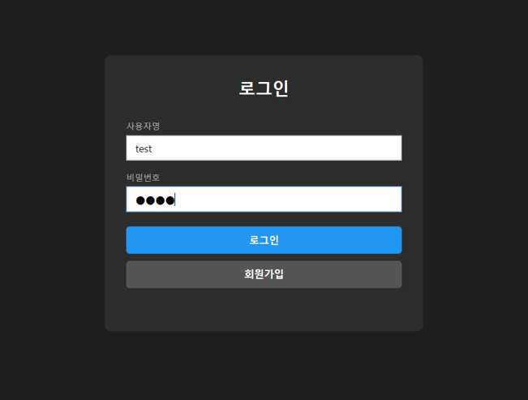
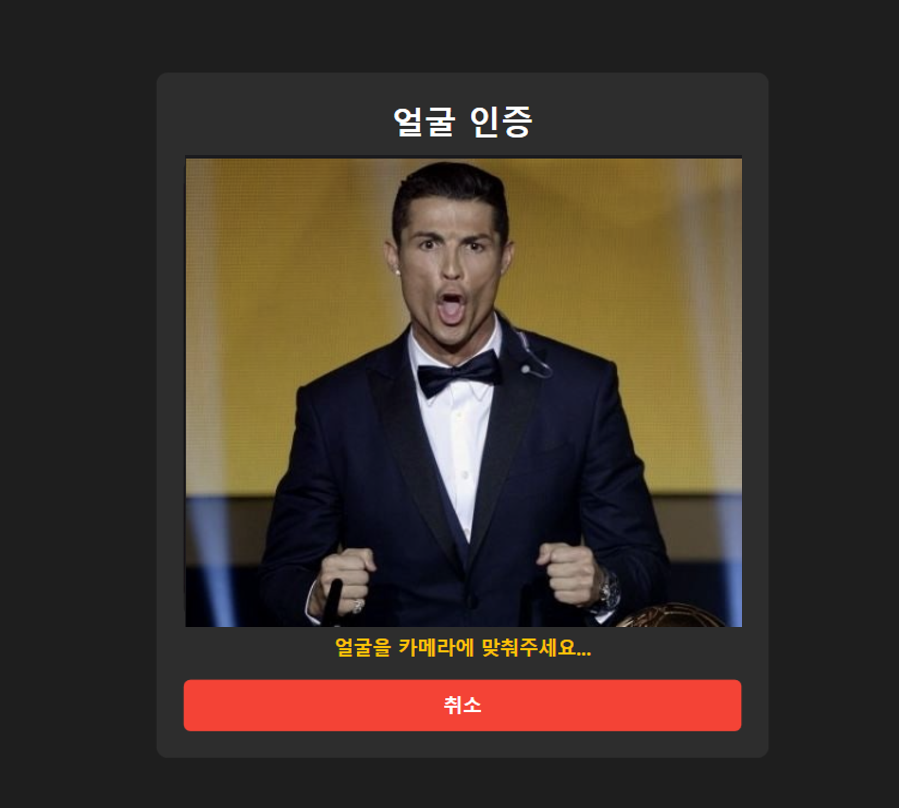
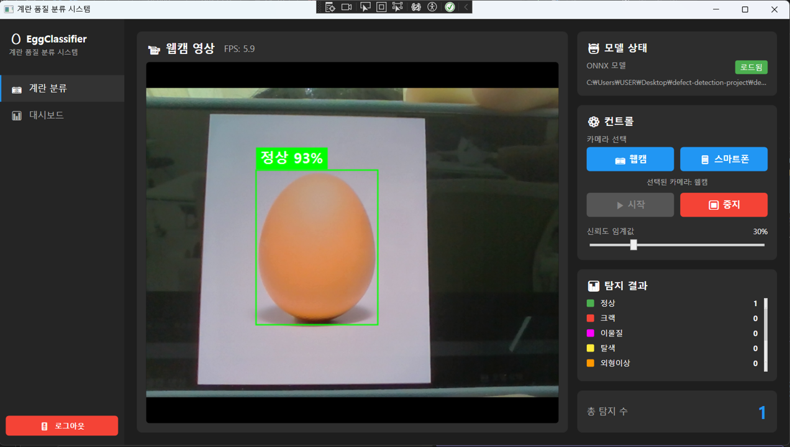
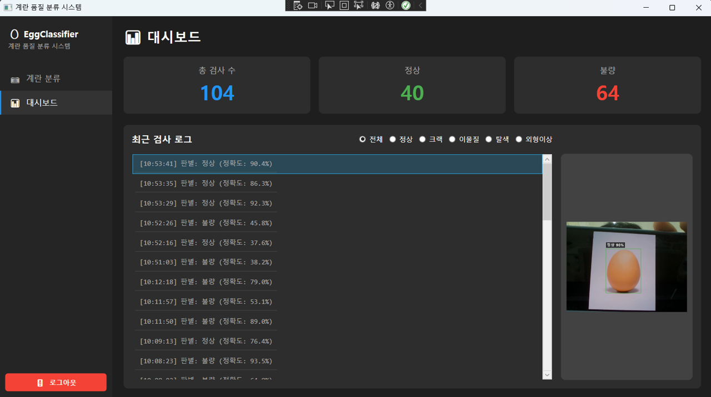

# EggClassifier - 계란 품질 실시간 분류 시스템

> YOLOv8 + MobileFaceNet 기반 계란 품질 실시간 분류 WPF 데스크톱 애플리케이션
>
> 웹캠으로 촬영한 계란의 품질을 AI가 실시간으로 5클래스 분류하고,
> 아이디/비밀번호 + 얼굴인식 2차 인증(2FA)으로 보안 로그인을 지원합니다.

---

## Demo

### 로그인 + 얼굴인식 2FA

| 1단계: 자격증명 입력 | 2단계: 얼굴 인증 |
|:---:|:---:|
|  |  |

### 계란 실시간 분류

| 실시간 탐지 |
|:---:|
|  |

### 대시보드

| 검사 통계 대시보드 |
|:---:|
|  |

---

## 사용 기술 스택

### Frontend (C# WPF)

| 기술 | 버전 | 용도 |
|------|------|------|
| .NET | 8.0 | 앱 프레임워크 |
| WPF | - | 데스크톱 UI |
| CommunityToolkit.Mvvm | 8.2.2 | MVVM 데이터 바인딩 + 커맨드 |
| Microsoft.Extensions.DependencyInjection | 8.0.1 | 의존성 주입 컨테이너 |

### AI / 영상 처리

| 기술 | 버전 | 용도 |
|------|------|------|
| YOLOv8n (Ultralytics) | 8.4.11 | 계란 품질 객체 탐지 모델 |
| MobileFaceNet (ONNX) | - | 얼굴 특징 벡터 추출 (128차원) |
| OpenCV Haar Cascade | - | 얼굴 영역 탐지 |
| Microsoft.ML.OnnxRuntime | 1.16.3 | ONNX 모델 추론 엔진 |
| OpenCvSharp4 | 4.9.0 | 웹캠 캡처 + 이미지 전처리 |

### Backend / DB

| 기술 | 버전 | 용도 |
|------|------|------|
| Supabase (PostgreSQL) | - | 사용자 관리 + 검사 로그 저장 |
| supabase-csharp | 0.16.2 | Supabase API 클라이언트 |

### 학습 환경 (Python)

| 기술 | 버전 | 용도 |
|------|------|------|
| Python | 3.13 | 학습 스크립트 실행 |
| PyTorch + Ultralytics | - | YOLOv8 모델 학습 |
| CUDA | 12.4 | GPU 가속 (선택) |

---

## 시스템 아키텍처

### 전체 파이프라인

```
┌─────────────────────┐     ┌──────────────────────────────┐     ┌─────────────────┐
│   Python 학습 환경    │     │        C# WPF 앱 (MVVM)       │     │   Supabase DB    │
│                     │     │                              │     │                 │
│  AI Hub 데이터       │     │  View (XAML UserControl)     │     │  users 테이블    │
│       ↓             │     │       ↕ 데이터 바인딩          │     │  (계정, 얼굴)    │
│  XML → YOLO 변환    │     │  ViewModel (ViewModelBase)   │     │                 │
│       ↓             │     │       ↕ DI 주입               │     │  egg 테이블      │
│  YOLOv8 학습        │     │  Service (인터페이스 + 구현체)  │     │  (검사 로그)     │
│       ↓             │     │       ↕                      │     │                 │
│  ONNX 내보내기 ─────────→  Model / AI 추론 엔진  ←──────────→ │                 │
└─────────────────────┘     └──────────────────────────────┘     └─────────────────┘
```

### 앱 내부 구조 (MVVM + DI + Feature 기반)

```
┌──────────────┐    바인딩    ┌──────────────────┐    DI 주입    ┌──────────────────┐
│     View     │ ←─────────→ │    ViewModel     │ ←──────────→ │     Service      │
│  (XAML UI)   │             │ (ViewModelBase)  │              │  (인터페이스)      │
└──────────────┘             └──────────────────┘              └────────┬─────────┘
                                                                       │
                                                          ┌────────────┴────────────┐
                                                          ↓                         ↓
                                                   ┌─────────────┐          ┌──────────────┐
                                                   │  AI Model   │          │  Supabase DB │
                                                   │ (ONNX 추론)  │          │ (PostgreSQL) │
                                                   └─────────────┘          └──────────────┘
```

### 서비스 레이어

| 서비스 | 인터페이스 | 구현체 | 역할 |
|--------|-----------|--------|------|
| 웹캠 | IWebcamService | WebcamService | 웹캠 캡처 + 프레임 이벤트 (Singleton) |
| 탐지 | IDetectorService | DetectorService | YoloDetector 래핑 |
| 얼굴 | IFaceService | FaceService | Haar Cascade + MobileFaceNet 래핑 |
| 사용자 | IUserService | SupabaseUserService | 회원가입 / 로그인 (SHA256+Salt) |
| 검사 로그 | IInspectionService | InspectionService | 분류 결과 + 이미지 저장 / 통계 조회 |
| DB 클라이언트 | ISupabaseService | SupabaseService | Supabase 연결 관리 (Singleton) |

### AI 모델

| 모델 | 파일 | 입력 | 출력 | 크기 |
|------|------|------|------|------|
| YoloDetector | egg_classifier.onnx | 640x640 RGB | 5클래스 바운딩박스 | 11.7MB |
| MobileFaceNet | mobilefacenet.onnx | 112x112 RGB | 128차원 임베딩 벡터 | ~5MB |
| Haar Cascade | haarcascade_frontalface_default.xml | Grayscale 이미지 | 얼굴 좌표 (Rect) | ~930KB |

---

## Key Features

### 1. 실시간 계란 불량 탐지

YOLOv8 모델을 통해 웹캠 영상에서 계란을 5가지 클래스로 실시간 분류합니다.

| 클래스 ID | 한글명 | 영문명 | 표시 색상 |
|-----------|--------|--------|-----------|
| 0 | 정상 | normal | 녹색 |
| 1 | 크랙 | crack | 빨강 |
| 2 | 이물질 | foreign_matter | 마젠타 |
| 3 | 탈색 | discoloration | 노랑 |
| 4 | 외형이상 | deformed | 주황 |

```
웹캠 프레임 → Letterbox 전처리 → ONNX 추론 → NMS 후처리 → 바운딩박스 시각화 → DB 저장
```

**학습 성능**

| 메트릭 | 값 |
|--------|-----|
| mAP50 | 93.4% |
| mAP50-95 | 93.3% |
| Precision | 87.7% |
| Recall | 86.5% |
| 추론 속도 | ~17.5ms/이미지 (GPU) |
| 모델 크기 | 11.7MB (ONNX) |

### 2. 2단계 인증 로그인 (비밀번호 + 얼굴인식 2FA)

```
[1단계: 자격증명]
  아이디 + 비밀번호 입력 → Supabase 조회 → SHA256+Salt 검증
       ↓ (성공)
[2단계: 얼굴 인증]
  웹캠 자동 시작 → Haar Cascade 얼굴 탐지
  → MobileFaceNet 임베딩 추출 → DB 저장 임베딩과 코사인 유사도 비교
  → 유사도 >= 80%, 연속 10프레임 매칭 시 인증 성공
       ↓ (성공)
[로그인 완료]
  → 사이드바 표시 → 계란 분류 페이지로 자동 이동
```

### 3. 회원가입 + 얼굴 등록

- 아이디 / 비밀번호 입력 + 역할 선택 (USER / ADMIN)
- 웹캠으로 얼굴 촬영 → MobileFaceNet 128차원 임베딩 추출
- Supabase `users` 테이블에 계정 정보 + 얼굴 임베딩 저장

### 4. 실시간 대시보드

- 검사 통계 조회 (총 검사 수, 정상/불량 비율)
- 1초 간격 자동 갱신
- 클래스별 필터링

### 5. 검사 로그 저장

- 분류 결과 (클래스, 정확도) + 계란 이미지를 Supabase `egg` 테이블에 자동 저장
- 사용자별 검사 이력 관리

---

## Installation and Setup

### 1. 사전 요구사항

| 항목 | 요구사항 |
|------|---------|
| OS | Windows 10 / 11 |
| 런타임 | [.NET 8.0 SDK](https://dotnet.microsoft.com/download/dotnet/8.0) |
| Python | [Anaconda](https://www.anaconda.com/download) (모델 학습 시) |
| 하드웨어 | 웹캠 (USB 또는 내장) |
| GPU (선택) | NVIDIA GPU + CUDA 12.x |

### 2. 저장소 클론

```bash
git clone https://github.com/isangbin/defect-detection-project.git
cd defect-detection-project
```

### 3. 모델 학습 (Python)

```bash
# Python 환경 설정
conda create -n sf_py python=3.13
conda activate sf_py
cd demo/training
pip install -r requirements.txt

# AI Hub 데이터 변환 (XML → YOLO 포맷)
python convert_xml_to_yolo.py ^
    --train-images "D:\원천데이터\Training" ^
    --train-labels "D:\라벨링데이터\Training" ^
    --val-images "D:\원천데이터\Validation" ^
    --val-labels "D:\라벨링데이터\Validation" ^
    --output "../data"

# YOLOv8 학습
python train.py --data ../data/data.yaml --model n --epochs 50 --batch 32

# ONNX 내보내기
python export_onnx.py --model runs/detect/egg_classifier/weights/best.pt --output ../models --verify

# 얼굴인식 모델 다운로드
python download_face_models.py
```

### 4. Supabase 설정

1. [supabase.com](https://supabase.com)에서 프로젝트 생성
2. SQL Editor에서 테이블 생성:

```sql
-- users 테이블
CREATE TABLE public.users (
  idx SERIAL PRIMARY KEY,
  user_id VARCHAR NOT NULL UNIQUE,
  user_password TEXT NOT NULL,
  user_name VARCHAR,
  user_face FLOAT[] NOT NULL,
  user_role VARCHAR DEFAULT 'user'
);

-- egg 테이블
CREATE TABLE public.egg (
  idx SERIAL PRIMARY KEY,
  user_id VARCHAR NOT NULL,
  egg_class INTEGER NOT NULL,
  accuracy DOUBLE PRECISION NOT NULL,
  inspect_date TIMESTAMP DEFAULT CURRENT_TIMESTAMP,
  egg_image BYTEA NOT NULL,
  CONSTRAINT fk_user FOREIGN KEY (user_id) REFERENCES public.users(user_id)
);

-- 인덱스 생성
CREATE INDEX idx_users_user_id ON public.users(user_id);
CREATE INDEX idx_egg_user_id ON public.egg(user_id);
CREATE INDEX idx_egg_inspect_date ON public.egg(inspect_date);
```

3. `demo/EggClassifier/appsettings.json`에 연결 정보 입력:

```json
{
  "Supabase": {
    "Url": "https://your-project-id.supabase.co",
    "Key": "your-anon-public-key"
  }
}
```

### 5. 앱 빌드 및 실행

```bash
# ONNX 모델 배치
copy demo\models\egg_classifier.onnx demo\EggClassifier\Models\egg_classifier.onnx

# 빌드 및 실행
cd demo/EggClassifier
dotnet restore
dotnet build
dotnet run
```

### 6. 사용 흐름

```
앱 실행 → 회원가입 (아이디 + 비밀번호 + 얼굴 촬영)
       → 로그인 1단계 (자격증명) → 2단계 (얼굴 인증)
       → 계란 분류 ([시작] 버튼 → 실시간 분류)
       → 대시보드 (검사 통계 확인)
       → 로그아웃
```

---

## 프로젝트 구조

```
defect-detection-project/
├── README.md
├── demo/
│   ├── training/                       ← Python 학습 스크립트
│   │   ├── convert_xml_to_yolo.py
│   │   ├── train.py
│   │   ├── export_onnx.py
│   │   ├── download_face_models.py
│   │   └── requirements.txt
│   ├── models/                         ← ONNX 모델 파일
│   │   ├── egg_classifier.onnx
│   │   ├── mobilefacenet.onnx
│   │   └── haarcascade_frontalface_default.xml
│   ├── data/                           ← YOLO 데이터셋 (학습 후 생성)
│   └── EggClassifier/                  ← C# WPF 애플리케이션
│       ├── App.xaml / App.xaml.cs       ← DI 컨테이너, DataTemplate
│       ├── MainWindow.xaml             ← 셸 (사이드바 + ContentControl)
│       ├── appsettings.json            ← Supabase 연결 정보
│       ├── Core/                       ← 네비게이션 인프라
│       ├── Models/                     ← 데이터 모델 + AI 추론 엔진
│       │   └── Database/               ← Supabase 엔티티
│       ├── Services/                   ← 비즈니스 로직 서비스
│       ├── Features/
│       │   ├── Detection/              ← 계란 분류 (웹캠 + YOLO)
│       │   ├── Login/                  ← 로그인 (2FA) + 회원가입
│       │   └── Dashboard/              ← 대시보드 (통계 시각화)
│       └── ViewModels/
│           └── MainViewModel.cs
```

---

## 데이터베이스 스키마

### users 테이블

| 컬럼명 | 타입 | 설명 |
|--------|------|------|
| idx | SERIAL (PK) | 자동 증가 기본키 |
| user_id | VARCHAR (UNIQUE) | 사용자 아이디 |
| user_password | TEXT | 비밀번호 해시 ("hash:salt" 형식) |
| user_name | VARCHAR | 사용자 이름 (선택) |
| user_face | FLOAT[] | 얼굴 임베딩 벡터 (128차원) |
| user_role | VARCHAR | 역할 ("USER" 또는 "ADMIN") |

### egg 테이블

| 컬럼명 | 타입 | 설명 |
|--------|------|------|
| idx | SERIAL (PK) | 자동 증가 기본키 |
| user_id | VARCHAR (FK) | 검사 수행 사용자 ID |
| egg_class | INTEGER | 계란 클래스 (0~4) |
| accuracy | DOUBLE PRECISION | 분류 정확도 (0~1) |
| inspect_date | TIMESTAMP | 검사 일시 (자동 설정) |
| egg_image | BYTEA | 계란 이미지 (PNG 바이트 배열) |

---

## 팀원

| 이름 | 담당 |
|------|------|
| 이귀현 | - |
| 임상빈 | - |
| 송용승 | - |
| 양태균 | - |
